

  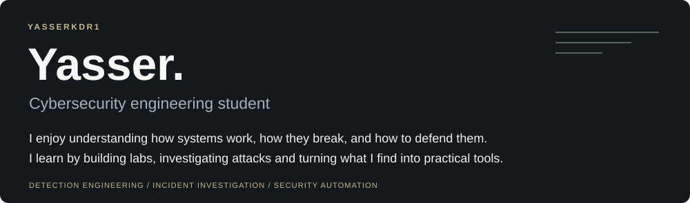

<h2>Selected projects</h2>

<a href="https://github.com/Yasserkdr1/golden-image_factory">
  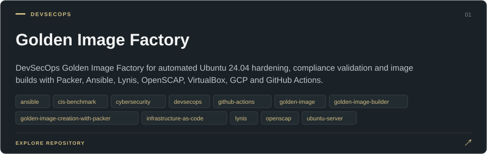
</a>

&nbsp;<b>View the pipline </b> &nbsp;·&nbsp; <code>Packer → Ansible → Hardening → Lynis/OpenSCAP → Golden Image</code>

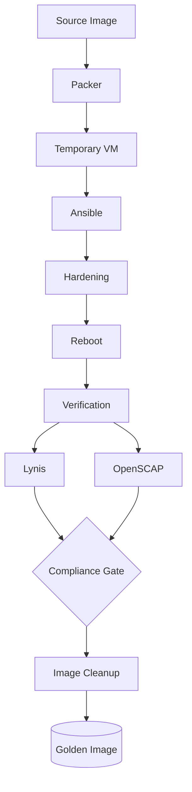

  <a href="https://github.com/Yasserkdr1/golden-image_factory">Explore project ↗</a>
  &nbsp; · &nbsp;
  <a href="https://github.com/Yasserkdr1/golden-image_factory/stargazers">☆ Stars</a>

 

<a href="https://github.com/Yasserkdr1/Automated-soc-investigation-lab">
  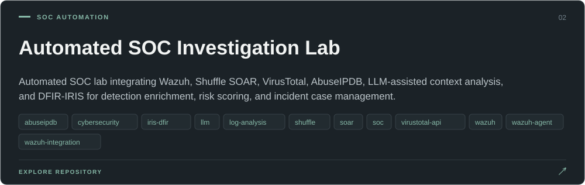
</a>

&nbsp;<b>View workflow SOAR</b> &nbsp;·&nbsp; <code>Wazuh Alert → Enrichment (VT/AbuseIPDB) → LLM context → Risk Score → DFIR-IRIS</code>

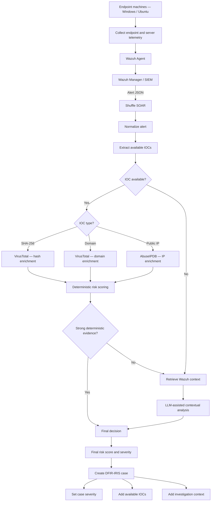

  <a href="https://github.com/Yasserkdr1/Automated-soc-investigation-lab/blob/main/architecture/shuffle-workflow.jpg">View the workflow in Shuffle ↗</a>

  <a href="https://github.com/Yasserkdr1/Automated-soc-investigation-lab">Explore project ↗</a>
  &nbsp; · &nbsp;
  <a href="https://github.com/Yasserkdr1/Automated-soc-investigation-lab/stargazers">☆ Stars</a>

 

<table>
<tr>
<td width="50%" valign="top">

<a href="https://github.com/Yasserkdr1/Wazuh-Multi-Signal-Web-Shell-Detection">
  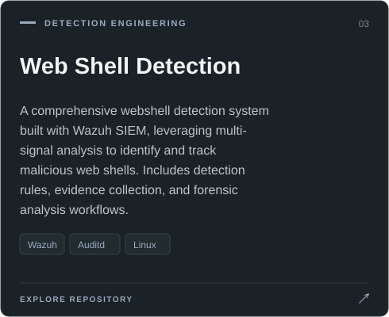
</a>

&nbsp;<b>View architecture</b> &nbsp;·&nbsp; <code>Traffic/Logs → Wazuh Rules → Multi-signal Correlation → Evidence</code>

  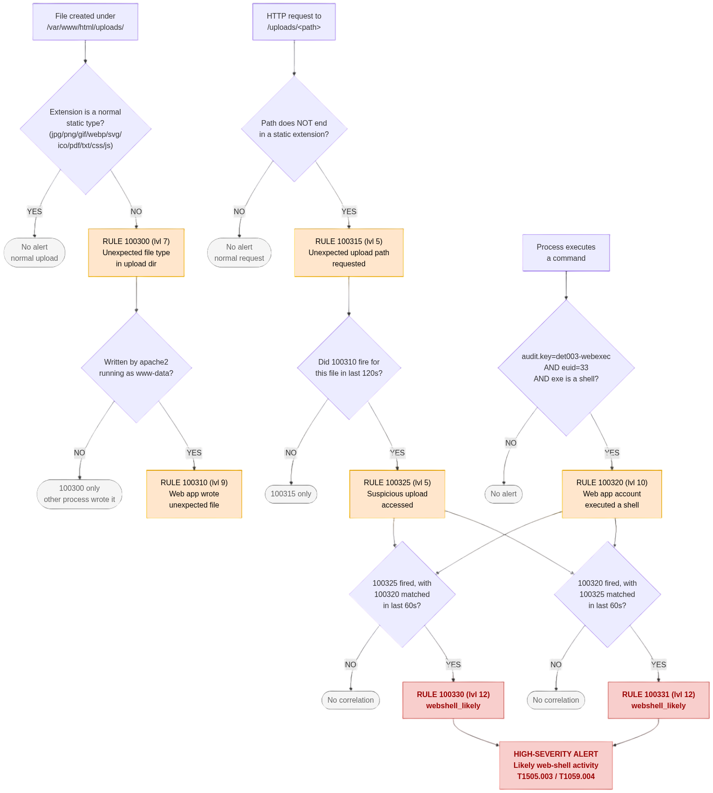

  <a href="https://github.com/Yasserkdr1/Wazuh-Multi-Signal-Web-Shell-Detection">Explore project ↗</a>
  &nbsp; · &nbsp;
  <a href="https://github.com/Yasserkdr1/Wazuh-Multi-Signal-Web-Shell-Detection/stargazers">☆ Stars</a>

</td>
<td width="50%" valign="top">

<a href="https://github.com/Yasserkdr1/CyberThreat-Analytics-Pipeline">
  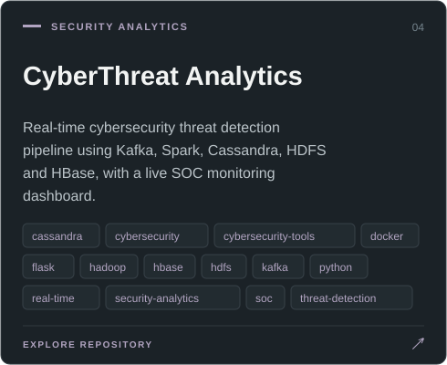
</a>

&nbsp;<b>View architecture</b> &nbsp;·&nbsp; <code>Kafka → Spark → Cassandra/HDFS/HBase → Dashboard</code>

  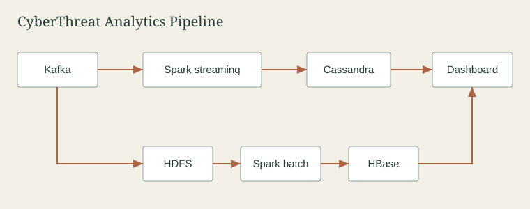

  <a href="https://github.com/Yasserkdr1/CyberThreat-Analytics-Pipeline">Explore project ↗</a>
  &nbsp; · &nbsp;
  <a href="https://github.com/Yasserkdr1/CyberThreat-Analytics-Pipeline/stargazers">☆ Stars</a>

</td>
</tr>

<tr>
<td width="50%" valign="top">

<a href="https://github.com/Yasserkdr1/Soc-Investigation-Writeups">
  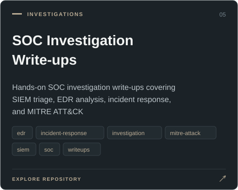
</a>

  <a href="https://github.com/Yasserkdr1/Soc-Investigation-Writeups">Explore project ↗</a>
  &nbsp; · &nbsp;
  <a href="https://github.com/Yasserkdr1/Soc-Investigation-Writeups/stargazers">☆ Stars</a>

</td>
<td width="50%" valign="top">

<a href="https://github.com/Yasserkdr1/LeanMassCalculator">
  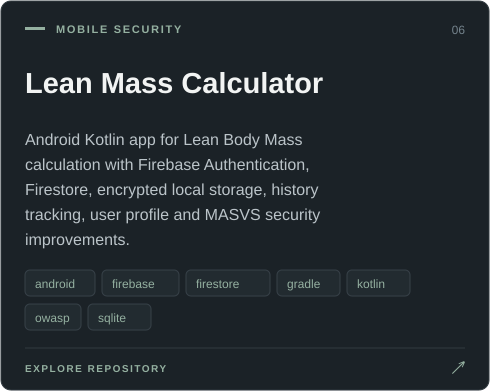
</a>

  <a href="https://github.com/Yasserkdr1/LeanMassCalculator">Explore project ↗</a>
  &nbsp; · &nbsp;
  <a href="https://github.com/Yasserkdr1/LeanMassCalculator/stargazers">☆ Stars</a>

</td>
</tr>
</table>
